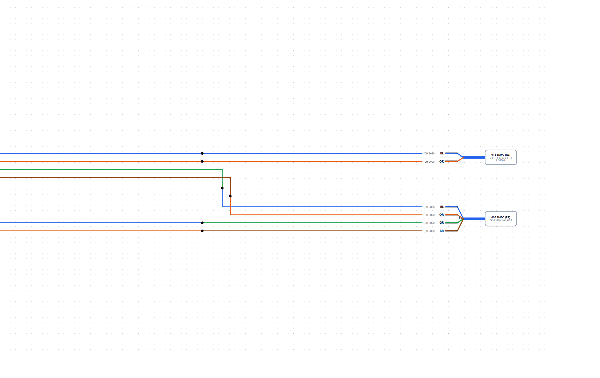
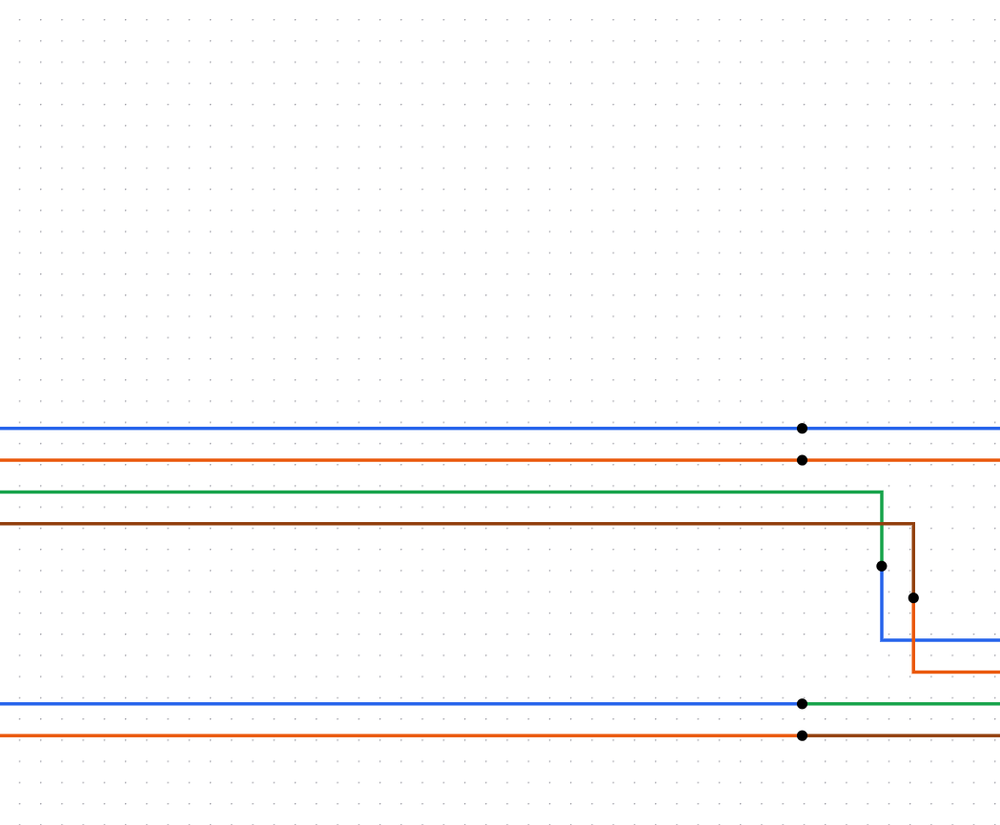
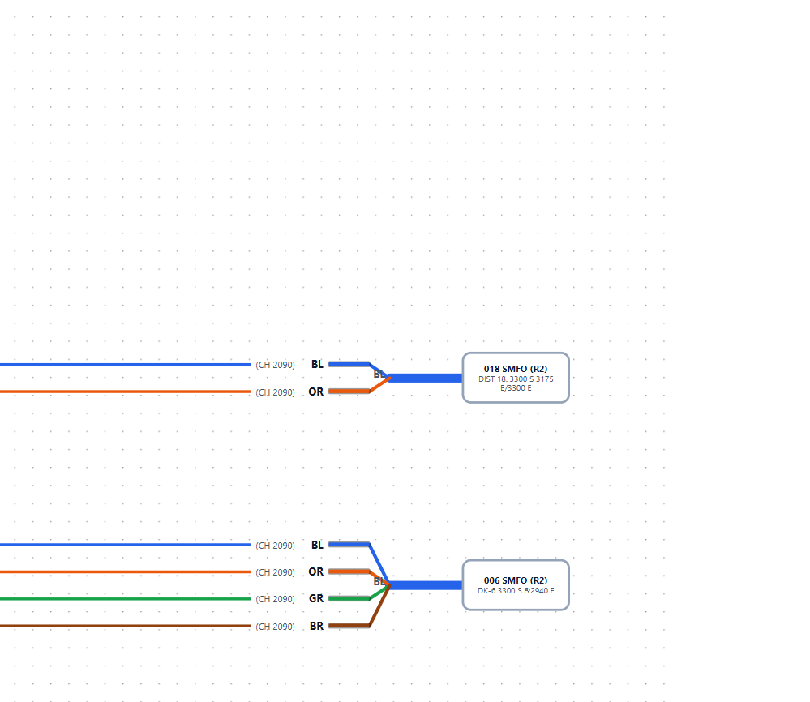

# Canvas component glossary

> **Use this when talking to agents.** Say “the cable sheath” or “fusion splice dot” and we mean the same UI piece.  
> Screenshots are from **live app** after importing Example #2 (`?fixture=example-2` in dev).

## Full diagram



Left = source cables. Center = splice routing zone. Right = target cable labels and handles.

---

## Components (outside → center)

### 1. Cable node (`CableNode`)

**What it is:** One **cable leg** in this diagram (not always one physical cable — ring-cut can show two legs for one name).

**Includes:** SMFO count label, cable name, sheath body, buffer tubes, fiber strands, shared label column.



| Part | Description | Code / data |
|------|-------------|-------------|
| **SMFO label** | Top line, e.g. `006 SMFO (R2)` | `CableNodeData.smfoLabel` |
| **Cable name** | Second line, e.g. `6 DROP (SC) 3300'S & 3175'E` | `CableNodeData.label` |
| **Cable sheath** | Rounded body / circle the tubes exit from | `computeCableBreakout`, `computeSheathSize` |
| **Cable stub** | Short horizontal from sheath toward canvas edge | Part of cable node SVG |
| **Side** | Left or right edge of diagram | `CableNodeData.side` |

**Related rules:** CBL-001–005, TUB-001–005, STR-001

---

### 2. Buffer tube

**What it is:** Thick **colored** line from sheath toward center — one per tube color group (BL, OR, GR…).

| Part | Description |
|------|-------------|
| **Tube stem** | Diagonal/horizontal colored segment from sheath |
| **Tube tip** | End nearest the fiber label column |
| **Striped tube** | Dashed stroke for 145–288 fiber striped codes (e.g. BL-BK) |

**Related rules:** TUB-001–008

---

### 3. Fiber strand

**What it is:** Thin **colored horizontal line** for one spliced fiber (only pairs in CSV are drawn).

| Part | Description |
|------|-------------|
| **Strand line** | Thin colored line at fixed 24px row pitch |
| **Fiber label column** | Circuit tag + color code (e.g. `BL (CH 2090)`) — shared vertically per side |
| **Fan direction** | Left cables fan **right**; right cables fan **left** |

**Related rules:** FBR-001–004, STR-001, TUB-007

---

### 4. Splice edge (`SpliceEdge`)

**What it is:** Center **routing line** connecting two fiber or collapsed tube handles.


| Part | Description |
|------|-------------|
| **Splice path** | Orthogonal H–V–H segments between handles |
| **Fusion splice dot** | Small black dot at the splice elbow / meeting point |
| **Center lane (`midX`)** | Vertical segment X in the splice zone — distinct per strand on import |
| **Gap horizontals** | Segments between cable label column and center vertical |
| **Bundle trunk (`jogX`)** | Shared horizontal for fibers from same tube → same target cable |

**Related rules:** EDGE-001–012 (EDGE-004 = ≤2 bends)

---

### 5. Right-side handles & labels



| Part | Description |
|------|-------------|
| **Target handle** | Where center splice line meets the right cable column |
| **OS / circuit column** | Right-side text labels splices run past before turning vertical (EDGE-009) |

---

### 6. Collapsed full-butt tube (when enabled)

**What it is:** When all 12 fibers in a tube splice to another full tube, individual fiber breakouts hide and a **thick tube-to-tube** center line is used instead.

**Toggle:** “Collapse full butt splices” (auto on import when detected).

**Related rules:** EDGE-004 (collapsed), TUB-008

---

## React Flow mapping

| Canvas piece | React Flow type | Notes |
|--------------|-----------------|-------|
| Whole cable graphic | `node` type `cable` | Composite SVG — tubes/fibers inside |
| Center splice line | `edge` type `splice` | `SpliceEdge.tsx` + `spliceEdgeRouting.ts` |
| Layout overrides | `localStorage` | Drag positions, dashed “protect in place” |

---

## Dev: reload Example #2 for screenshots

```bash
npm run dev
# open http://localhost:5173/?fixture=example-2
```

Fixture CSV: `public/fixtures/example-2.csv` (copy of reference Example #2).

**Regenerate crops** after retaking `00-full-diagram-example-2.png`:

```powershell
powershell -ExecutionPolicy Bypass -File scripts/crop-glossary-shots.ps1
```

---

## See also

- [`RULE_DICTIONARY.md`](./RULE_DICTIONARY.md) — plain-English layout rule IDs
- [`LAYOUT_RULES.md`](./LAYOUT_RULES.md) — full rule spec
